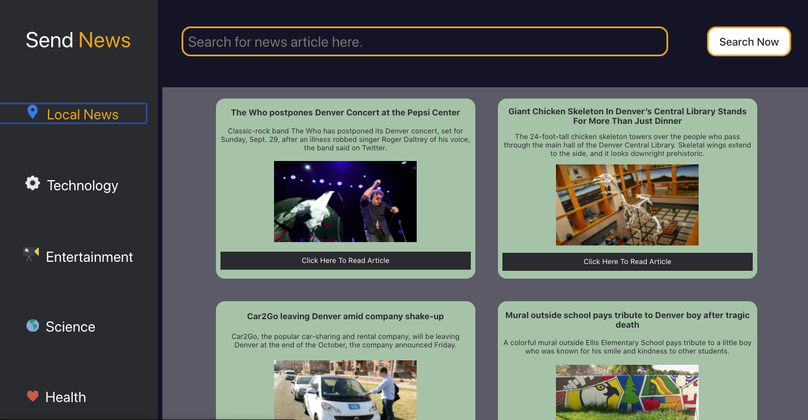

# Send News!- Get all the latest news about Science, Technology and Health all in one place.  

This project was the first solo project for Module 3 at Turing School of Software And Design. This was also my first project in React.

The basic idea for this app was to get familiar with React components, state and passing of props as well as practice unit and interaction testing with Jest and
React Testing Library.

## Installing / Getting started

Clone down the repo. Use terminal commands to navigate to the root folder of the repo locally.

1. npm install
2. cd into src folder
3. npm start
4. navigate to local port:3000 in your browser

## Steps to use the App

The app is very simple to use and only has two "functions" As you load the app you will see cards with news articles on the right side. You can click on the buttons on the left side in the menu bar to load news from different topics.

You can also use the search bar up above to search the content and title of the article.

## Screenshots:

### Live site link
[Github Pages]()

### Technologies Used

* React
* JSX
* Jest and React Testing Library
* Fetch API

## Learning Goals

## Practice and demonstrate understanding of the following:

* Using Basic React Class and Functional Components
* Implement Unit and Integration testing with React Testing Library

## Challenges

This was my first time using React and I found it to be very different from
Vanilla JS but also it makes more sense to me. The biggest issues so far has been
testing.

## Wins

I was able to accomplish all of the functionality and styling required without much struggle. 
